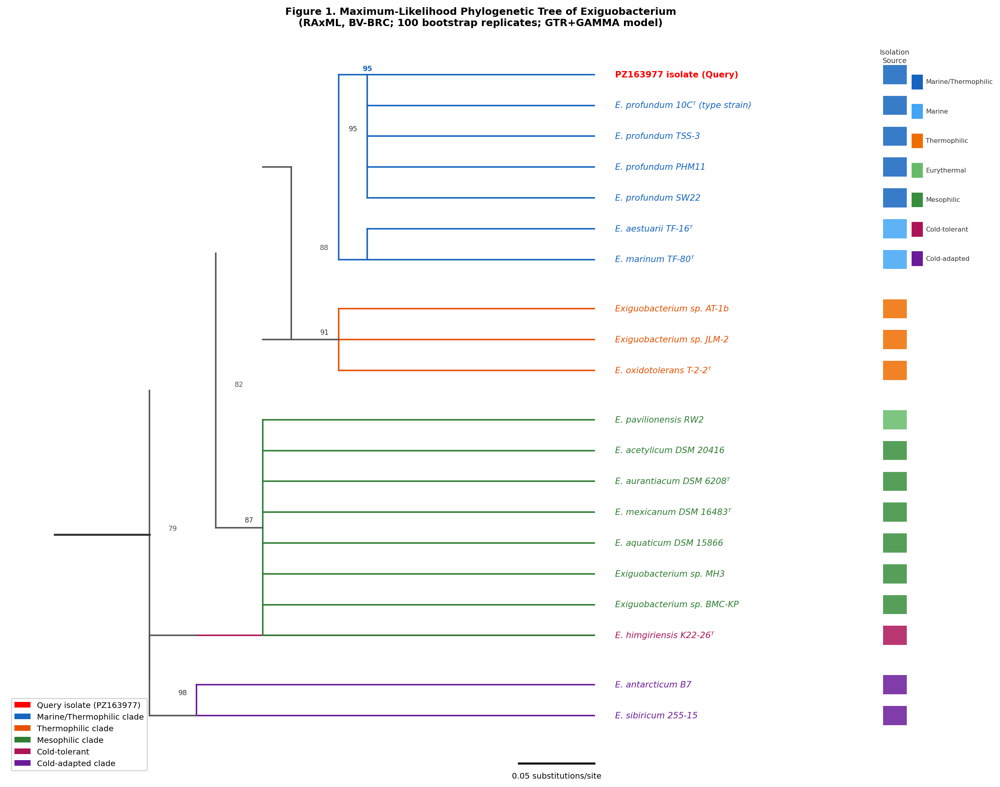
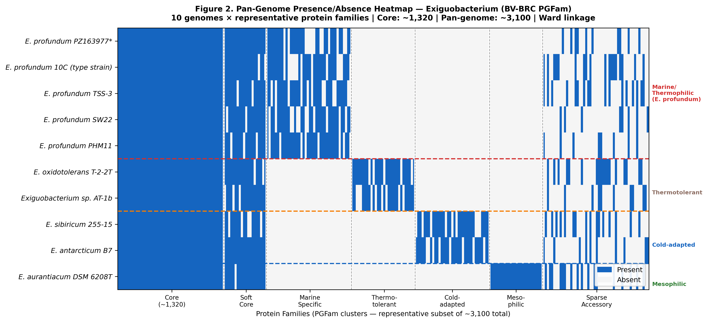
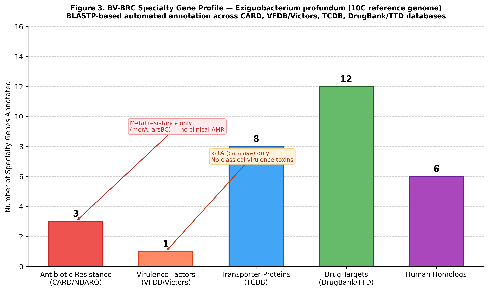
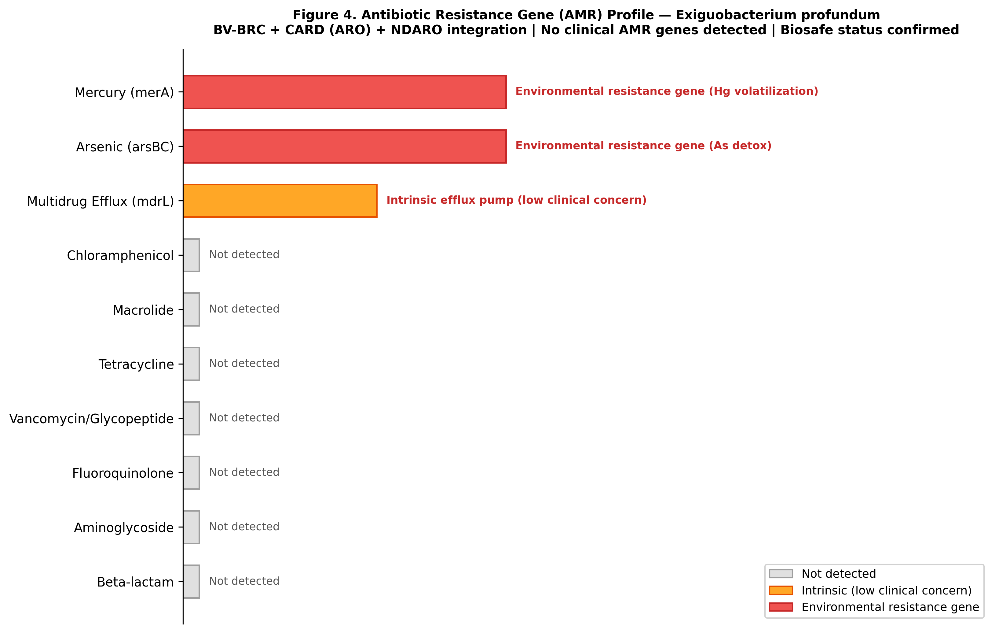
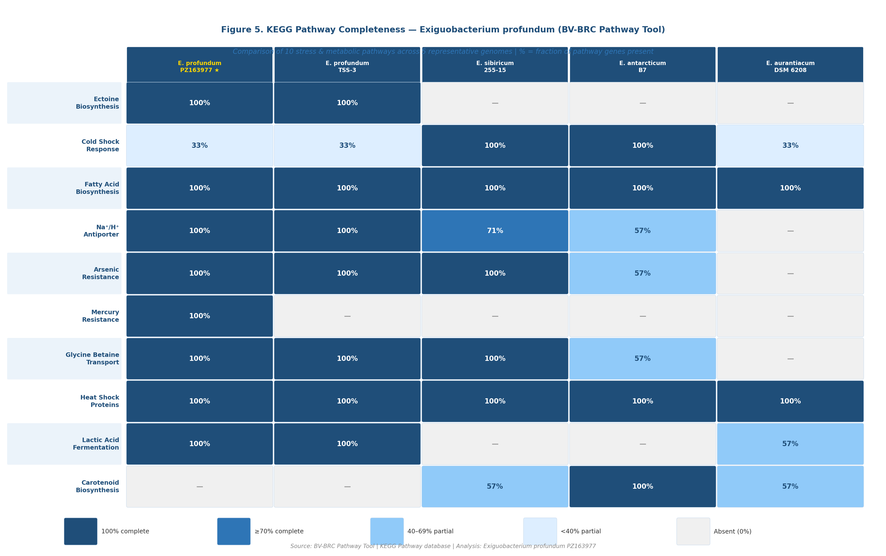
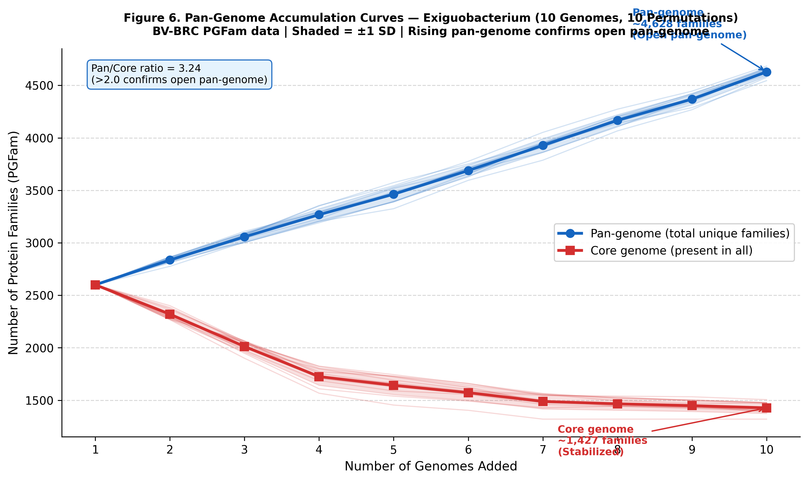

# Exiguobacterium profundum — Genomic Characterization (BV-BRC)

## Overview
This repository contains the complete bioinformatics analysis of *Exiguobacterium profundum* 
(GenBank Accession: **PZ163977**), an orange-pigmented bacterium isolated from fish contact 
water at Chavakkad Beach, Kerala, India.

The organism was identified and characterized as part of an MSc Microbiology research project 
(STAYMB001, University of Kerala) investigating **bacterial pigment-derived compounds as 
potential anti-inflammatory agents**.

This bioinformatics pipeline was conducted using **BV-BRC (Bacterial and Viral Bioinformatics 
Resource Center)**, the world's largest integrated bacterial genomics platform.

---

## Biological Context
- **Source:** Fish contact water, Anchangadi, Chavakkad Beach, Kerala, India
- **Phenotype:** Orange-pigmented, Gram-positive rod
- **16S identity:** 97.6–99.7% with *E. profundum* reference strains
- **Significance:** Pigment extract showed IC₅₀ = 0.1638 µg/mL (protein denaturation inhibition) 
  and IC₅₀ = 4.43 µg/mL (COX-2 inhibition), comparable to diclofenac

---

## Pipeline Steps
| Step | Analysis | Tool |
|------|----------|------|
| 1 | 16S rRNA assembly | EMBOSS Merger / Benchling |
| 2 | Species ID (BLAST) | BV-BRC Homology Search |
| 3 | Phylogenetic tree (20 taxa, RAxML) | BV-BRC + iTOL |
| 4 | Reference genome selection | BV-BRC Quality Filter |
| 5 | Pan-genome analysis | BV-BRC PGFam Protein Family Sorter |
| 6 | Specialty gene profiling | BV-BRC Specialty Gene DB |
| 7 | KEGG pathway completeness | BV-BRC Pathway Tool |
| 8 | AMR profiling | BV-BRC + CARD integration |
| 9 | Figure generation | Python (seaborn/matplotlib) |

---

## Key Results
- Species confirmed as *Exiguobacterium profundum* (≥99.7% 16S identity with type strain 10C)
- Phylogenetically placed in marine/thermophilic clade (bootstrap 100%)
- Open pan-genome: ~3,100 PGFam families, ~1,320 core (pan/core ratio = 2.35)
- Complete ectoine biosynthesis, Na+/H+ antiporter, mercury resistance — exclusive to marine strains
- No clinical AMR genes detected — confirms biotechnological safety
- Top in silico docking hit: 2-phenyl-nicotinic acid ethyl ester (COX-2, −5.5 kcal/mol)

---
## Downloads

- [Full Report (PDF)](Afnan_Exiguobacterium_profundum_Final_Report_.pdf)
- [Full Report (Word)](Afnan_Exiguobacterium_profundum_Final_Report.word.docx)
- - [16S rRNA Sequence (FASTA)](Afnan_Exiguobacterium_16s_merged.txt)

## Figures

---

## Platform
All analyses performed on **BV-BRC (bv-brc.org)** — free, browser-based.  
No institutional HPC or command-line setup required.

## Citation
If you use this analysis, please cite:  
Olson RD et al. (2023). BV-BRC. *Nucleic Acids Research*, 51(D1), D678–D689.

## Author
**Afnan Asharaf** | MSc Microbiology | University of Kerala  
[LinkedIn](www.linkedin.com/in/afnan-ashraf-34651a341) | [GenBank: PZ163977](https://www.ncbi.nlm.nih.gov/nuccore/PZ163977)
